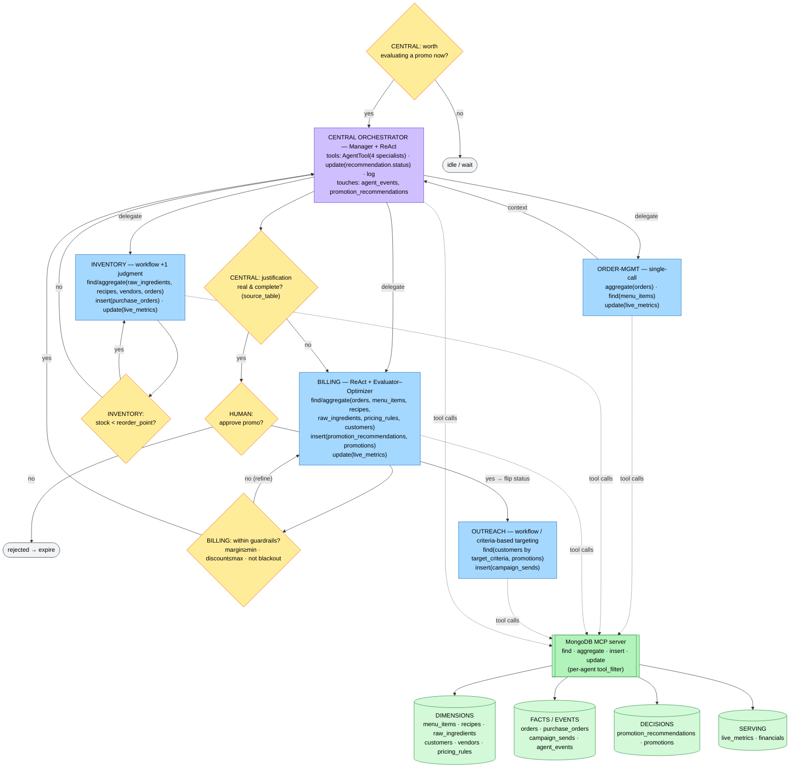

# Restaurant GM

An agentic general manager for independent restaurants. Five Gemini agents — coordinated by a central orchestrator — watch the order stream in real time, manage inventory, and propose evidence-backed flash promotions. The owner approves every customer-facing move.

Built for the **Google Cloud Rapid Agent Hackathon**, MongoDB partner track.

---

## What it does

- **Live dashboard**: order stream, shift revenue and covers, cash on hand, daily P&L, live inventory with spoilage tracking, purchase orders, and an agent activity feed in the agents' own words.
- **Autonomous inventory**: when stock crosses a reorder point, the inventory agent reviews velocity, waste history, and available cash — then orders, right-sizes, or holds ("we threw away $38 of this last week"). Dead-stock items are flagged to avoid doubling down on ingredients that aren't selling.
- **Evidence-backed promotions**: triggers like sales-pace deviation or ingredient surplus wake the central agent. The billing agent builds a recommendation where every number cites its source collection, selects a strategy (ride the wave / boost the underdog / clear the surplus), and picks a real audience segment (affinity-based, deal-seekers, or open to walk-ins).
- **Human gate**: promos go live only when the owner clicks Approve. Then billing configures it, outreach notifies targeted opted-in customers, and redemptions are reconciled live — predicted vs. actual, per promo.

---

## Architecture

### Agents

| Agent | Role |
|---|---|
| **Central** | Orchestrator. Coordinates the four specialists, validates recommendations, owns the approve/reject gate, and logs all activity to `agent_events`. |
| **Inventory** | Monitors stock levels, derives the 86 list, evaluates reorder decisions, flags dead stock, and places purchase orders via MCP. |
| **Order-mgmt** | Sales analyst over the order stream — velocity, top movers, pace vs. baseline. |
| **Billing** | Computes margins, builds promo recommendations with full justification and predicted lift, and configures approved promotions. |
| **Outreach** | Targets opted-in customers by criteria, sends campaign notifications, and tracks redemptions. |

### Data layer

MongoDB Atlas is the nervous system, not just storage.

- **Change Streams** drive everything: six deterministic plumbing listeners (BOM stock depletion, replenishment, metric rollups, daily P&L, redemption reconciliation, spoilage) plus the dashboard's SSE feed and the autonomous trigger worker — all react to writes in real time.
- **MongoDB MCP server** is the agents' write path: every purchase order, recommendation, promotion, and campaign send is an agent-composed MCP call.
- **Unique indexes enforce business invariants** against LLM nondeterminism: one open PO per ingredient, one promo per recommendation — racing agent runs physically cannot double-act.
- **Star schema**: `orders` fact table at line-item grain, dimension collections (menu, recipes, ingredients, customers, vendors), and a serving layer (`live_metrics`, `financials`) materialized for the always-on dashboard.

### Division of labor

*Detection is plumbing. Decisions are agents. Invariants live in the database.*

Deterministic code owns: order ingestion, BOM-based stock depletion, base metric rollups, daily P&L, and redemption reconciliation. Agents own judgment — when to reorder, what to promote, who to target.

| Script | Trigger | Does |
|---|---|---|
| `plumbing/depletion.py` | order insert | decrements `raw_ingredients.on_hand_qty` via BOM |
| `plumbing/replenishment.py` | PO status → `received` | increments `raw_ingredients.on_hand_qty` per PO line items |
| `plumbing/reconcile.py` | order insert with a `promo_id` | increments `promotions.redemption_count`, marks `campaign_sends` redeemed, syncs `active_promo_perf` actuals |
| `plumbing/rollups.py` | order insert | recomputes `live_metrics` base fields + upserts the current sim-day's `financials` doc |
| `plumbing/worker.py` | change stream watch | fires Central on low stock, pace deviation, or human approval |

### Agent frameworks

| Framework | Used by | Why |
|---|---|---|
| **ReAct** | Central, Billing | Next action depends on the last observation |
| **Evaluator–Optimizer** | Billing | Must validate a promo against guardrails before surfacing |
| **Workflow** | Inventory, Order-mgmt, Outreach | Deterministic-ish tasks where a loop adds no value |

### Agent flowchart



---

## Stack

- **Agents**: Google Agent Development Kit (ADK), `gemini-3.5-flash` on Vertex AI
- **Database**: MongoDB Atlas — Change Streams, MCP server, star schema
- **Backend**: FastAPI (`adk api_server`) + Python plumbing
- **Frontend**: React + Vite, served statically from FastAPI
- **Deploy**: Cloud Run — two services (app + always-on worker)

---

## Running locally

```bash
pip install -r requirements.txt
cp .env.example .env          # fill MONGODB_CONNECTION_STRING, GOOGLE_API_KEY
python seed_data.py           # populate Atlas with simulated data
python -m plumbing.launcher   # start all plumbing listeners
adk web                       # dev UI at localhost:8000
```

The MongoDB MCP server runs via `npx` (Node required alongside Python).

---

## Data conventions

| Convention | Rule | Example |
|---|---|---|
| **Money** | Integer cents in a Money object. Never floats. | `$14.00` → `{ "amount": 1400, "currency": "USD" }` |
| **Timestamps** | RFC 3339 UTC | `"2026-06-14T22:31:05Z"` |
| **IDs** | Prefixed strings | `ord_`, `cust_`, `ing_`, `rec_`, `po_`, `promo_` |
| **Audit** | Every doc carries `created_at`, `updated_at`, `source`, `schema_version` | |

See `DATA_MODEL.md` for the full schema.

---

## License

MIT — see `LICENSE`.
