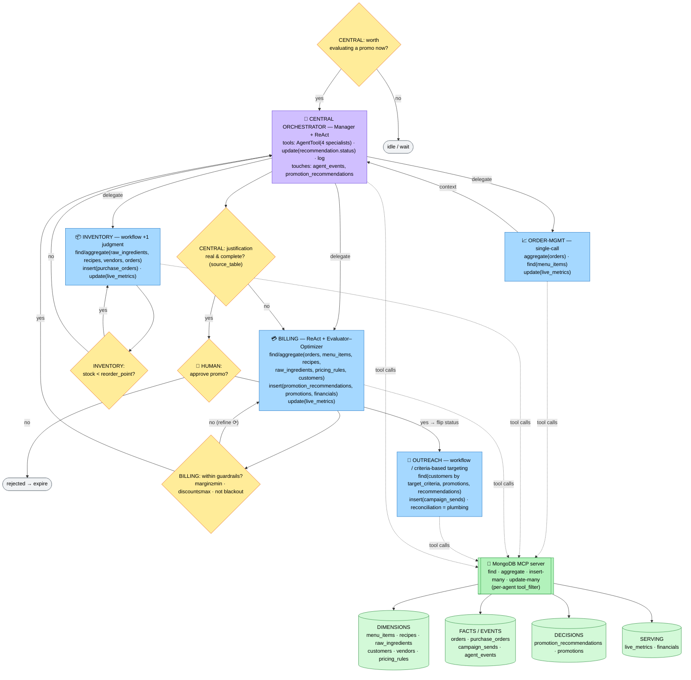
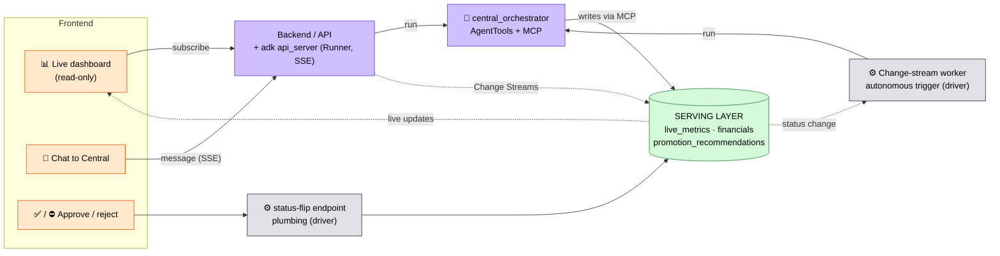

# Restaurant GM — Data Model

## TODO
- [ ] Drop the 2h promo duration option (keep 24h/72h): configuration takes ~1 real minute and at demo SIM_SPEED the sim outruns a 2h window before the promo can even collect redemptions — billing YAML `duration_hours` choices + `get_sim_now` offsets
- [ ] Sim clock regression: ▶ snaps the topbar to the new day's 12 AM, but the next change event (waste toss / PO received / `publish_availability` → live_metrics doc with the old `as_of`) reverts it to the last order's time until the first new order lands. Fix: make the dashboard clock monotonic (ignore incoming sim_now older than current) and/or stamp `as_of` at day start
- [ ] Promo targeting stuck on one segment again: every promo shows just "opted-in only". Two parts: (1) display bug — `CriteriaPills` always appends "opted-in only", and for an open `{}` promo that's the ONLY pill, so it reads as targeted; open promos should show "open to everyone (incl. walk-ins)"; (2) verify billing on gemini-3.5-flash actually varies target_criteria run-to-run — if it ruts, add "do not repeat the previous promo's segment" using recent promos as context
- [ ] **Financial realism redesign** — cash is too abundant and ingredient costs too low (e.g. $8/kg guacamole), so the inventory funds check never bites and every reorder sails through. Want: realistic vendor pricing, lower STARTING_CASH, and recurring cost drains (rent/labor per sim-day in financials + cash) so money is actually scarce → enables the demo drama: inventory consults billing about affordability, holds back orders, negotiates priorities ("cash is tight — which matters more, cheese or a promo discount budget?")
- [ ] Outreach lag after "live!": promo goes live (Mode B) before outreach finishes its run (~30s later), and eligible customers/walk-ins can redeem the moment it's live — notification was never the redemption gate (see eligibility design note), so early redemptions are BY DESIGN, but document it on the dashboard (e.g. live card shows "notifying…" until sends land) so it doesn't look like a bug
- [ ] Purchase orders table: cap height + scrollbar so older placed orders don't bury the panel (currently grows unbounded up to 10 rows)
- [ ] Chat polish: collapse tool-call/agent-transfer activity lines into a blinking "show thinking…" collapsible (like LLM chat UIs) instead of printing raw MongoDB invocations inline; expanded view keeps the full trace for transparency
- [ ] **✨ Analyze button on past promos** (agentic retro): each past-promo row gets an "Analyze" button → backend endpoint → worker-style Runner invocation → an agent post-mortem grounded in real data (predicted vs actual uptake, redemptions by segment from campaign_sends + orders, demand lift on the promoted items during the window vs before, margin impact from financials) answering: did it succeed or flop, WHY, what we learned, and what to do differently next time. Result lands in agent_events (or a `promo_retros` collection) and renders in the expanded promo detail — closes the recommend → approve → measure → LEARN loop
- [ ] Add `max_tool_calls` (or equivalent ADK budget) to each agent YAML to hard-cap round-trips — order_mgmt=3, inventory=3, billing=4, outreach=2, central=8
- [x] Fix Gemini `print(default_api.aggregate(...))` code-generation bug — fixed 2026-06-10 by moving all fixed-workflow reads to deterministic helper tools (`restaurant_gm/queries.py`, driver-backed, trivial/no arguments): the model no longer authors complex pipelines, which is exactly where the bug fired. Also set `temperature: 0` on every agent. MCP remains the write path + ad-hoc reads
- [ ] Establish MIT License (hackathon requirement)
- [x] Simulator realism (done 2026-06-11): Poisson arrivals with lunch/dinner peaks (HOURLY_RATE); item popularity learned empirically from the historical baseline (units sold per item — keeps live mix/margins consistent with seed history); known customers order their `favorite_item_ids` ~3× as often (makes affinity-targeted promos measurably real); line-item quantities skew low (mostly 1-2); plus promo demand-lift and availability gating
- [ ] Demo sim plan: run ~7 sim-days at high SIM_SPEED (500-1000x) to show the full lifecycle in one shot — orders deplete stock → Inventory agent reorders → simulator auto-receives POs (lead_time_days from vendors schema) → Billing spots a pattern and recommends a promo → human approves → Outreach pushes → redemptions land on the dashboard
- [x] `plumbing/reconcile.py` — done 2026-06-10: change-stream listener counts redemptions per order (`promotions.redemption_count`, `campaign_sends.redeemed` + `redeemed_order_id`, `live_metrics.active_promo_perf` actuals); idempotent via a `reconciled` claim flag; `--rebuild` recounts from facts and runs in the simulator's reset path
- [x] `plumbing/worker.py` — done 2026-06-10: single-flight change-stream watcher invoking Central via the ADK Runner. Three triggers with suppression: (1) low stock → autonomous reorder (open-PO pre-check via `stock_snapshot()` + per-ingredient cooldown); (2) promo opportunity — `sales_pace_vs_baseline_pct` beyond ±15% (suppressed while a `pending` rec or `live` promo exists, global cooldown); (3) `promotion_recommendations.status` → `approved` → Billing Mode B + Outreach. Each run's final agent response is logged to `agent_events`
- [x] **Decided 2026-06-10: reorders are autonomous, promos are human-gated.** Done: inventory's funds check reads `cash_on_hand_cents` from `stock_snapshot()`; the human approval gate (dashboard-only) applies only to customer-facing promos
- [x] `financials` is populated by **plumbing, not Billing** (deterministic P&L = invariant #3). Done 2026-06-10: `plumbing/financials.py` backfills one doc per sim-day (revenue, discounts, COGS from the static item→food-cost map via recipes, margin, by_category); `rollups.py` upserts the current sim-day's doc on each order insert; `live_metrics.cash_on_hand_money` = STARTING_CASH ($25k, env-overridable) + Σ all-time pre-tax net revenue − committed vendor spend — this is what the inventory funds check reads
- [x] Reset clears everything (done 2026-06-10): `simulator --reset` now also deletes `purchase_orders`, `promotion_recommendations`, `promotions`, `campaign_sends`, `agent_events`, unsets all live_metrics insight fields, and rebuilds derived state. For a dimensions-too factory reset, re-run `seed_data.py` then `rollups --rebuild`

---

Scope: four reasoning agents (**Inventory, Order-mgmt, Billing, Outreach**) plus a
**Central orchestrator**. No seating, staffing, or live-sports agents. All data
is simulated.

---

## Conventions

| Convention | Rule | Example |
|---|---|---|
| **Money** | Integer minor units (cents) in a Money object. Never floats. | `$14.00` → `{ "amount": 1400, "currency": "USD" }` |
| **Timestamps** | RFC 3339 / ISO 8601, UTC (`Z`). | `"2026-06-14T22:31:05Z"` |
| **IDs** | Prefixed strings + Mongo `_id`. | `ord_`, `cust_`, `cat_`, `ing_`, `rec_`, `ven_`, `po_`, `promo_` |
| **Audit** | Every doc: `created_at`, `updated_at`, `source`, `schema_version`. | |
| **Foreign keys** | Plain string IDs referencing another collection's primary ID. | |

## Architecture in one paragraph

A **dimensional (star) core**: `orders` is the fact table at **line-item grain**,
surrounded by dimension collections (menu, recipes, ingredients, customers,
vendors, pricing rules). A **serving layer** (`live_metrics`, `financials`) is
materialized from the facts so the always-on dashboard reads cheap summaries.
The live "orders coming in" behavior is driven by **MongoDB Change Streams**: a
simulated order inserted -> the stream fires -> agents react and the serving
layer updates -> the dashboard refreshes.

**Plumbing vs. reasoning.** Three things are deterministic functions, NOT LLM
steps: (1) order ingestion + **BOM-based stock depletion** (when an order lands,
a function reads the static recipe and decrements `raw_ingredients`), (2)
base metric rollups (revenue, covers, and committed vendor spend from
`purchase_orders`), and (3) redemption reconciliation
(`campaign_sends.redeemed` joined back to `orders`). Agents reason over the *results*:
Inventory decides reorders and derives the 86 list, Order-mgmt analyzes the sales
stream, Billing computes margin/feasibility and builds + predicts promo recommendations,
Outreach targets opted-in customers and records sends (redemption reconciliation is
plumbing).

| Script | Trigger | Does |
|---|---|---|
| `plumbing/depletion.py` | order insert (change stream) | decrements `raw_ingredients.on_hand_qty` via BOM |
| `plumbing/replenishment.py` | PO status → `received` (change stream) | increments `raw_ingredients.on_hand_qty` per PO line items |
| `plumbing/reconcile.py` | order insert with a `promo_id` line item (change stream) | increments `promotions.redemption_count`, marks the pushed customer's `campaign_sends` doc redeemed, syncs `active_promo_perf` actuals |
| `plumbing/rollups.py` | order insert (change stream) | recomputes `live_metrics` base fields (revenue, covers, vendor spend, cash on hand) + upserts the current sim-day's `financials` doc |
| `plumbing/financials.py` | manual / reset (`rollups --rebuild` calls it) | backfills one `financials` P&L doc per sim-day from `orders` × the static BOM |
| `plumbing/simulator.py` tick | `expected_delivery <= sim_now` | flips overdue `placed` POs to `received`, triggering replenishment |
| `plumbing/simulator.py` order build | per order | availability gate: 86'd items can't be ordered (stock checked against the BOM, qty capped at what stock can make; customer turned away if nothing is available) — paired with a floor-at-0 clamp in `depletion.py` so `on_hand_qty` can never go negative |

**86 status is derived, never stored on `menu_items`.** An item is unavailable
when the ingredients its recipe needs fall below threshold; the Inventory agent
computes this from `raw_ingredients` + `recipes` and publishes it to `live_metrics`.

---

# Agent architecture

A **manager / sub-agent** setup. The agentic framework is chosen per task, not
one-size-fits-all: **ReAct only where control flow is dynamic; a fixed workflow
elsewhere.** Plumbing (order ingestion, BOM depletion, rollups, the approve/reject
trigger) is plain code with no LLM and is omitted here — see the prose above.

| Framework | Used by | Why |
|---|---|---|
| **ReAct** (reason → act → observe → loop) | Central, Billing | Next action depends on the last observation |
| **Evaluator–Optimizer** (generate → self-check → refine) | Billing | Must validate a promo against guardrails before surfacing |
| **Workflow** (fixed steps / single judgment call) | Inventory, Order-mgmt, Outreach | Deterministic-ish tasks; a loop adds no value |

Each specialist is an ADK `LlmAgent` with a split data path:

- **Fixed-workflow reads** go through deterministic **helper tools** in
  [`restaurant_gm/queries.py`](restaurant_gm/queries.py) (`stock_snapshot`,
  `sales_snapshot`, `promo_evidence`, `promo_audience`, `get_sim_now`) — driver-backed,
  one call returns everything the workflow needs, with all arithmetic (sums, margins,
  PO quantities, date math) precomputed (invariant #3). The model passes trivial or no
  arguments, which also eliminates the Gemini pipeline-authoring codegen bug.
- **All agent writes** (purchase orders, recommendations, promotions, campaign sends,
  live_metrics insight fields) and **ad-hoc analyst reads** go **through the MongoDB
  MCP server** — the agent composes the call and interprets the results.

The other deterministic, driver-based code is the high-frequency, per-order
**plumbing**: order ingestion + BOM depletion, base-metric rollups + daily financials,
and redemption reconciliation. Agent configs live in
[`restaurant_gm/*.yaml`](restaurant_gm/) (`root_agent.yaml` is Central).

The diagram shows each agent, the **tool calls** it makes (expressed as
`find / aggregate / insert / update`), the **data sources** those calls touch
(via the MongoDB MCP server's per-agent `tool_filter`), and the **decision points**
for both the agents and the human. Full per-agent reads/writes are in the
[Per-agent read/write summary](#per-agent-readwrite-summary) at the bottom.



---

# Serving & frontend

The frontend is **one page (a React SPA) with two panels** — an always-on live
dashboard and a chat to Central — plus an approve/reject action. They're not two pages;
they're two connections from the same page that meet only at the approval gate.

- **Dashboard (live, read-only):** does NOT go through the agents or MCP. It reads the
  serving layer (`live_metrics`, `financials`, `promotion_recommendations`) and stays
  live via **Change Streams**. Cheap, and keeps updating even when no agent is running.
- **Chat (request/response):** Central is the ADK root agent, so it is the user-facing
  NL entry point. ADK serves it over an API (`adk api_server` / Cloud Run, with SSE
  streaming + sessions); a chat component posts messages and streams tokens back.
- **Approval gate (where the two meet):** the human clicks approve/reject on a dashboard
  card; that hits a **thin status-flip endpoint** (plumbing, plain driver) which flips
  `promotion_recommendations.status` → a Change Stream fires → Central re-enters its loop.
  Approve/reject never has to go through chat.

Central is invoked from **two sources**, only one of which is the chat API:
1. a **user chat message** (via `adk api_server`), and
2. **autonomous promo evaluation** — a **background worker** that watches Change Streams
   and calls the ADK Runner when an opportunity arises (the same Central agent, run
   programmatically). For a demo this can be faked via chat and added later.



## Concrete stack: FastAPI + React

ADK's serving layer **is FastAPI** — `get_fast_api_app()` returns a real FastAPI app
already exposing session + streaming (`/run_sse`) endpoints backed by a `Runner` (the
ADK engine that runs the agent and streams `Event`s). So there is **one backend**: that
app, with our own routes mounted alongside it.

- **FastAPI backend** (single origin):
  - chat → ADK's `/run_sse` (provided by `get_fast_api_app`),
  - dashboard feed → our SSE/WebSocket route tailing a MongoDB **Change Stream** (`motor`)
    on `live_metrics` / `promotion_recommendations`,
  - approve/reject → our route doing the status flip (`motor` write).
- **React SPA** (one page) talks to that single origin:
  - dashboard panel → `EventSource` on the feed route,
  - chat panel → streaming `fetch` / `EventSource` on `/run_sse`,
  - approve button → `POST` to the status-flip route.
- **Autonomous trigger** → either a Change-Stream worker calling the `Runner` directly,
  or ADK's built-in trigger endpoints (`get_fast_api_app(..., trigger_sources=[...])`,
  e.g. Cloud Scheduler → Pub/Sub → `/trigger`).

The agent YAMLs in [`restaurant_gm/`](restaurant_gm/) are the reasoning core; this
FastAPI backend, the Change-Stream listener + status-flip endpoint, the React SPA, and
the autonomous trigger worker are the serving/IO shell around them (not yet built).

---

# Dimensions (master data — read-only during service)

## `menu_items`
Static catalog. Read by Order-mgmt (item context) and Billing (price/margin).

| Field | Type | Notes |
|---|---|---|
| `item_id` | string | PK, e.g. `cat_item_lager_01` |
| `name` | string | |
| `category` | enum | `starters` \| `mains` \| `drinks` \| `desserts` |
| `price_money` | Money | List price |
| `recipe_id` | FK->recipes | The BOM that backs this item |
| `tags` | string[] | `high_margin`, `shareable`, ... |

```json
{
  "item_id": "cat_item_lager_01",
  "name": "Pint — House Lager",
  "category": "drinks",
  "price_money": { "amount": 600, "currency": "USD" },
  "recipe_id": "rec_lager_01",
  "tags": ["high_margin", "alcohol"],
  "source": "toast", "schema_version": 1,
  "created_at": "2026-01-04T15:00:00Z", "updated_at": "2026-01-04T15:00:00Z"
}
```

## `recipes` (BOM)
Static bill of materials: maps a menu item to its raw ingredients + quantities.
Read by Inventory (map a low ingredient back to affected items) and Billing
(food cost). **Nobody writes this during service.**

| Field | Type | Notes |
|---|---|---|
| `recipe_id` | string | PK, e.g. `rec_lager_01` |
| `menu_item_id` | FK->menu_items | 1:1 with the item |
| `yield_qty` | int | Servings produced |
| `ingredients` | obj[] | `{ ingredient_id (FK->raw_ingredients), qty, unit }` |

```json
{
  "recipe_id": "rec_burger_01",
  "menu_item_id": "cat_item_burger_01",
  "yield_qty": 1,
  "ingredients": [
    { "ingredient_id": "ing_beef_patty", "qty": 1, "unit": "each" },
    { "ingredient_id": "ing_bun",        "qty": 1, "unit": "each" },
    { "ingredient_id": "ing_cheese",     "qty": 1, "unit": "slice" }
  ],
  "source": "manual", "schema_version": 1,
  "created_at": "2026-01-04T15:00:00Z", "updated_at": "2026-01-04T15:00:00Z"
}
```

## `raw_ingredients` (inventory stock)
The one dimension with **dynamic stock**. `on_hand_qty` is mutated by plumbing
(depletion on sale, replenishment on PO receipt). Read by Inventory (monitor)
and Billing (stock feasibility).

| Field | Type | Notes |
|---|---|---|
| `ingredient_id` | string | PK, e.g. `ing_beef_patty` |
| `name` | string | |
| `unit` | enum | `each` \| `kg` \| `liter` \| `slice` ... |
| `on_hand_qty` | number | **Dynamic** |
| `par_level` | number | Target stock |
| `reorder_point` | number | Inventory agent reorders below this |
| `unit_cost_money` | Money | Latest cost per unit |
| `preferred_vendor_id` | FK->vendors | |

```json
{
  "ingredient_id": "ing_beef_patty",
  "name": "Beef patty (4oz)", "unit": "each",
  "on_hand_qty": 180, "par_level": 300, "reorder_point": 120,
  "unit_cost_money": { "amount": 95, "currency": "USD" },
  "preferred_vendor_id": "ven_metro_meats",
  "source": "manual", "schema_version": 1,
  "created_at": "2026-01-04T15:00:00Z", "updated_at": "2026-06-14T22:14:00Z"
}
```

## `customers` (CRM)
Guest profiles with demographics and behavioral signals. Read by Billing
(prediction, targeting) and Outreach (targeting, opt-in).

| Field | Type | Notes |
|---|---|---|
| `customer_id` | string | PK, e.g. `cust_8a3f2c` |
| `name` / `email_masked` | string | PII masked |
| `age` | int | |
| `gender` | enum | `M` \| `F` \| `other` \| `prefer_not_to_say` |
| `city` | string | e.g. `"Chicago"` |
| `state` | string | 2-letter, e.g. `"IL"` |
| `zip_code` | string | |
| `dietary_flags` | string[] | `vegetarian`, `gluten_free`, `vegan`, `halal`, `none` |
| `recency_days` | int | Days since last visit (RFM — R) |
| `lifetime_value_money` | Money | Total spend to date (RFM — M) |
| `avg_check_money` | Money | Average order value |
| `price_sensitivity` | float | 0–1, drives promo uptake prediction |
| `loyalty_tier` | enum | `none` \| `silver` \| `gold` |
| `opt_in_marketing` | bool | Outreach may only target `true` |
| `favorite_item_ids` | FK[]->menu_items | |

## `vendors`
Supplier catalog. Read by Inventory (price + lead time when reordering).

| Field | Type | Notes |
|---|---|---|
| `vendor_id` | string | PK, e.g. `ven_metro_meats` |
| `name` / `contact_masked` | string | |
| `supplies` | obj[] | `{ ingredient_id (FK), unit_cost_money, min_order_qty, lead_time_days }` |
| `rating` | float | 0–5, simulated reliability |

```json
{
  "vendor_id": "ven_metro_meats",
  "name": "Metro Meats Co.", "contact_masked": "orders@•••.com",
  "supplies": [
    { "ingredient_id": "ing_beef_patty", "unit_cost_money": { "amount": 95, "currency": "USD" }, "min_order_qty": 100, "lead_time_days": 1 }
  ],
  "rating": 4.6,
  "source": "manual", "schema_version": 1,
  "created_at": "2025-09-01T12:00:00Z", "updated_at": "2026-06-10T09:00:00Z"
}
```

## `pricing_rules` (config + location)
Singleton config holding Billing's guardrails and location-level facts.

| Field | Type | Notes |
|---|---|---|
| `rule_id` | string | PK, e.g. `cfg_default` |
| `min_margin_pct` | number | Billing won't recommend below this |
| `max_discount_pct` | number | Cap on any single promo |
| `blackout_item_ids` | FK[]->menu_items | Never discountable |
| `tax_rate_bps` | int | Sales tax (875 = 8.75%) |
| `currency` | string | `USD` |

---

# Facts / events

## `orders` (the fact table)
Header + embedded `line_items` (the grain). Written by the **order pipeline /
simulator** (plumbing). Read by Inventory (velocity), Order-mgmt (sales
analysis), Billing (sales/COGS).

| Field | Type | Notes |
|---|---|---|
| `order_id` | string | PK |
| `state` | enum | `OPEN` \| `COMPLETED` \| `CANCELED` |
| `channel` | enum | `DINE_IN` \| `TAKEOUT` |
| `customer_id` | FK->customers | Nullable |
| `guest_count` | int | |
| `opened_at` / `closed_at` | timestamp | |
| `line_items` | obj[] | `{ uid, item_id (FK->menu_items), name, quantity, unit_price_money, gross_money, applied_discount_money, promo_id (FK->promotions, nullable) }` |
| `total_money` / `total_tax_money` / `total_discount_money` / `net_amount_money` | Money | Precomputed |

```json
{
  "order_id": "ord_20260614_0042",
  "state": "COMPLETED", "channel": "DINE_IN",
  "customer_id": "cust_8a3f2c", "guest_count": 4,
  "opened_at": "2026-06-14T21:59:00Z", "closed_at": "2026-06-14T22:48:00Z",
  "line_items": [
    { "uid": "li_1", "item_id": "cat_item_lager_01", "name": "Pint — House Lager",
      "quantity": 6, "unit_price_money": { "amount": 600, "currency": "USD" },
      "gross_money": { "amount": 3600, "currency": "USD" },
      "applied_discount_money": { "amount": 720, "currency": "USD" },
      "promo_id": "promo_celebration_77" }
  ],
  "total_tax_money": { "amount": 252, "currency": "USD" },
  "total_discount_money": { "amount": 720, "currency": "USD" },
  "net_amount_money": { "amount": 2880, "currency": "USD" },
  "total_money": { "amount": 3132, "currency": "USD" },
  "source": "toast", "schema_version": 1,
  "created_at": "2026-06-14T21:59:00Z", "updated_at": "2026-06-14T22:48:00Z"
}
```

## `purchase_orders`
The Inventory agent's reorders to vendors. Written by Inventory.

| Field | Type | Notes |
|---|---|---|
| `po_id` | string | PK |
| `vendor_id` | FK->vendors | |
| `status` | enum | `draft` \| `placed` \| `received` \| `canceled` |
| `line_items` | obj[] | `{ ingredient_id (FK), qty, unit_cost_money, line_total_money }` |
| `total_money` | Money | |
| `placed_at` / `expected_delivery` / `received_at` | timestamp | |
| `created_by` | string | `agent:inventory` |

## `campaign_sends`
**Notification log only** — one doc per customer Outreach proactively pushed
(SMS/email/push). **Inserted by Outreach** (the push); `redeemed` /
`redeemed_order_id` are **reconciled by plumbing** (high-frequency, event-driven
— invariant #3). This is NOT the eligibility record for a promo; it tracks
whether a notified customer later redeemed. Eligibility is determined entirely by
`promotions.target_criteria` (see design note below).

Actual uptake is measured by joining `redeemed_order_id` back to `orders`.
Walk-in customers (`customer_id: null`) are never in this collection; they can
still redeem a promo if they happen to match `target_criteria` on their order.

| Field | Type | Notes |
|---|---|---|
| `send_id` | string | PK |
| `promo_id` | FK->promotions | |
| `customer_id` | FK->customers | Non-null: only tracked/known customers are pushed |
| `channel` | enum | `sms` \| `push` \| `email` |
| `status` | enum | `queued` \| `sent` \| `delivered` \| `failed` |
| `redeemed` | bool | Did this notified customer use the promo? |
| `redeemed_order_id` | FK->orders | Nullable |
| `sent_at` | timestamp | |

## `agent_events` (the transparency log)
Append-only. **Written by `plumbing/worker.py`** after each autonomous agent run:
the `summary`/`reasoning` fields carry the agent's own final response verbatim
(zero extra LLM calls). The dashboard's "Agent activity" feed and 🤖 toasts read
from here. Agents do not write it themselves (removed as overkill for chat-driven
actions, which are already visible in the chat).

| Field | Type | Notes |
|---|---|---|
| `event_id` | string | PK |
| `agent` | enum | `central` \| `inventory` \| `order_mgmt` \| `billing` \| `outreach` |
| `action` | string | e.g. `recommend_promo`, `place_po`, `flag_86` |
| `summary` | string | One-line human-readable |
| `reasoning` | string | Short rationale |
| `related_ids` | obj | `{ recommendation_id?, order_id?, promo_id?, po_id? }` |
| `created_at` | timestamp | |

---

# Decision artifacts

## `promotion_recommendations` (the heart of the product)
What Billing produces and the human approves. Carries the full justification so
the dashboard card can be transparent. Written by Billing; status flipped by
Central on the human's yes/no.

| Field | Type | Notes |
|---|---|---|
| `recommendation_id` | string | PK, e.g. `rec_77` |
| `status` | enum | `pending` \| `approved` \| `rejected` \| `expired` |
| `proposal` | obj | `{ title, description, discount_type, discount_value, applies_to_item_ids[], target_criteria{} }` |
| `justification.analytical` | obj[] | `{ metric, value, source_table, note }` — the real-data evidence |
| `justification.predictive` | obj | `{ predicted_uptake, predicted_incremental_revenue_money, predicted_margin_after_pct, confidence, model_note }` |
| `decided_by` / `decided_at` | string/ts | The human + when |
| `resulting_promo_id` | FK->promotions | Set on approval |
| `created_by` | string | `agent:billing` |

```json
{
  "recommendation_id": "rec_77",
  "status": "pending",
  "proposal": {
    "title": "House Lager — 20% for 30 min",
    "description": "Push the highest-margin drink while the room is full.",
    "discount_type": "PERCENTAGE", "discount_value": 20,
    "applies_to_item_ids": ["cat_item_lager_01"],
    "target_criteria": { "loyalty_tier": ["silver", "gold"], "max_price_sensitivity": 0.6, "city": "Chicago" }
  },
  "justification": {
    "analytical": [
      { "metric": "lager gross margin", "value": "77%", "source_table": "menu_items+recipes", "note": "even at 20% off, margin stays 71%" },
      { "metric": "current stock cover", "value": "~3.5 hrs", "source_table": "raw_ingredients", "note": "240 pints on hand" },
      { "metric": "opted-in target size", "value": "138 customers", "source_table": "customers", "note": "silver/gold loyalty, price_sensitivity < 0.6, Chicago, opt_in only" }
    ],
    "predictive": {
      "predicted_uptake": 0.34,
      "predicted_incremental_revenue_money": { "amount": 21500, "currency": "USD" },
      "predicted_margin_after_pct": 71,
      "confidence": 0.62,
      "model_note": "uptake scaled by price_sensitivity and loyalty_tier"
    }
  },
  "decided_by": null, "decided_at": null, "resulting_promo_id": null,
  "created_by": "agent:billing", "source": "matchday_gm", "schema_version": 1,
  "created_at": "2026-06-14T22:30:51Z", "updated_at": "2026-06-14T22:30:51Z"
}
```

## `promotions` (approved / live)
Created when a recommendation is approved. Written/configured by Billing; read
by Outreach to push. `redemption_count` reconciled from `campaign_sends`/`orders` by plumbing.

> **Design note — eligibility vs notification (updated 2026-06-09):**
> `target_criteria` is the **eligibility rule** for redemption, not just the
> outreach targeting list. Any customer whose profile matches all criteria in
> `target_criteria` can redeem the promo — whether or not they received a
> campaign push. Outreach uses the same criteria to decide who to notify
> proactively, which increases the probability those customers come in; but
> notification is not a prerequisite for redemption.
>
> Consequence for the order simulator and reconciliation plumbing: check
> `target_criteria` against the customer's profile to determine eligibility.
> `campaign_sends` is a separate signal — "did we push this customer?" — which
> raises their redemption probability but is not the gate. Walk-in customers
> (`customer_id: null`) have no profile to match against, so they cannot redeem
> *targeted* promos — but an **open promo (empty `target_criteria: {}`) reaches
> everyone, walk-ins included** (~40% of orders). Updated 2026-06-10: the
> simulator also applies a per-promo **demand lift** (derived from a hash of the
> promo_id: one third of promos get no lift, the rest 1.75×/2.5× item pick
> weight) so predicted vs actual uptake genuinely diverges — some promos pop,
> some flop, and the reconcile plumbing shows which.
>
> **Promo go-live timeline (clarified 2026-06-11):** the promo is LIVE the
> moment Billing's Mode B inserts the `promotions` doc — like a discount hitting
> the POS. From that instant, every eligible customer (and walk-ins, for open
> promos) can redeem it at the register, *before* anyone is notified. Outreach
> then runs (~30s later) as a **traffic driver, not a gate**: it pushes
> SMS/email to the targeted, opted-in customers to pull them in, which boosts
> their redemption probability (the campaign_sends 1.4× factor in the
> simulator). Redemptions that land between go-live and the outreach push are
> expected behavior, not a race condition.

| Field | Type | Notes |
|---|---|---|
| `promo_id` | string | PK |
| `recommendation_id` | FK->promotion_recommendations | |
| `title` / `description` | string | |
| `discount_type` / `discount_value` | enum/int | |
| `applies_to_item_ids` | FK[]->menu_items | |
| `target_criteria` | obj | **Eligibility rule** — any customer matching this can redeem (loyalty_tier, city, age range, dietary_flags, max_price_sensitivity, etc.) |
| `status` | enum | `live` \| `scheduled` \| `expired` |
| `valid_from` / `valid_until` | timestamp | |
| `predicted_uptake` | float | Carried from the recommendation |
| `redemption_count` | int | Actual, reconciled by plumbing — includes both pushed and organic redeemers |
| `approved_by` | string | |

---

# Serving / derived

## `live_metrics` (dashboard state)
A small current-state document the dashboard reads. Base fields (revenue,
covers) updated by plumbing; insight fields written by the agents.

| Field | Type | Written by |
|---|---|---|
| `as_of` | timestamp | plumbing |
| `shift_revenue_money` | Money | plumbing |
| `covers` | int | plumbing |
| `total_vendor_spend_money` | Money | plumbing — sum of `purchase_orders` with status `placed` or `received` (committed spend only) |
| `cash_on_hand_money` | Money | plumbing — operating cash: STARTING_CASH + Σ all-time pre-tax net revenue − committed vendor spend. The inventory agent's funds check reads this. |
| `gross_margin_pct` | number | Billing |
| `sales_pace_vs_baseline_pct` | number | plumbing ONLY (rollups, recomputed per order via the same `sales_snapshot` derivation the agent reads — chat and dashboard always agree) |
| `top_movers` | obj[] | plumbing ONLY (rollups) — `{ item_id, qty, velocity }` |
| `low_stock` | obj[] | plumbing ONLY (`publish_availability` on every real stock change) — `{ ingredient_id, status }` |
| `eighty_sixed_item_ids` | FK[]->menu_items | plumbing ONLY — an item stays 86'd until a delivery actually restocks it; placing a PO does not clear it (the agent must never write these fields) |
| `active_promo_perf` | obj[] | Billing — `{ promo_id, predicted_uptake, actual_redemptions }` |

## `financials` (periodic rollups)
Derived daily P&L. Written by **plumbing** (`plumbing/financials.py` backfill +
`rollups.py` live upsert — deterministic math, invariant #3); read by Billing
for margin context. Revenue is pre-tax (tax is a passthrough).

| Field | Type | Notes |
|---|---|---|
| `period_id` | string | PK, one per sim-day, e.g. `2026-06-14` |
| `period_start` / `period_end` | timestamp | |
| `gross_revenue_money` | Money | |
| `cogs_money` | Money | From orders x recipes |
| `discount_money` | Money | |
| `net_revenue_money` | Money | |
| `gross_margin_pct` | number | |
| `by_category` | obj[] | `{ category, revenue_money, margin_pct }` |

---

# Foreign-key map

```
menu_items.recipe_id ─────────────► recipes.recipe_id
recipes.ingredients[].ingredient_id ► raw_ingredients.ingredient_id
raw_ingredients.preferred_vendor_id ► vendors.vendor_id
vendors.supplies[].ingredient_id ───► raw_ingredients.ingredient_id

orders.line_items[].item_id ───────► menu_items.item_id
orders.line_items[].promo_id ──────► promotions.promo_id
orders.customer_id ────────────────► customers.customer_id

purchase_orders.vendor_id ─────────► vendors.vendor_id
purchase_orders.line_items[].ingredient_id ► raw_ingredients.ingredient_id

campaign_sends.promo_id ───────────► promotions.promo_id
campaign_sends.customer_id ────────► customers.customer_id
campaign_sends.redeemed_order_id ──► orders.order_id

promotion_recommendations.resulting_promo_id ► promotions.promo_id
promotions.recommendation_id ──────► promotion_recommendations.recommendation_id
```

# Per-agent read/write summary

| Agent | Reads | Writes |
|---|---|---|
| **Inventory** | raw_ingredients, recipes, vendors, orders (velocity) — via `stock_snapshot()` | purchase_orders |
| **Order-mgmt** | orders, menu_items — via `sales_snapshot()` | nothing (pure analyst; pace/top_movers are published by rollups plumbing) |
| **Billing** | orders, menu_items, recipes, raw_ingredients, pricing_rules, customers (demographics + behavioral signals), financials (margin context) | promotion_recommendations, promotions, live_metrics (margins), agent_events |
| **Outreach** | customers, promotion_recommendations, promotions | campaign_sends (sends/pushes), agent_events |
| **Central** | agent_events | promotion_recommendations (status on approval), agent_events |
| **Pipeline (plumbing)** | recipes (for depletion), campaign_sends + orders (for reconciliation) | orders, raw_ingredients (deplete/replenish), live_metrics (base incl. cash on hand), financials (daily P&L), campaign_sends (redemption reconciliation) |
