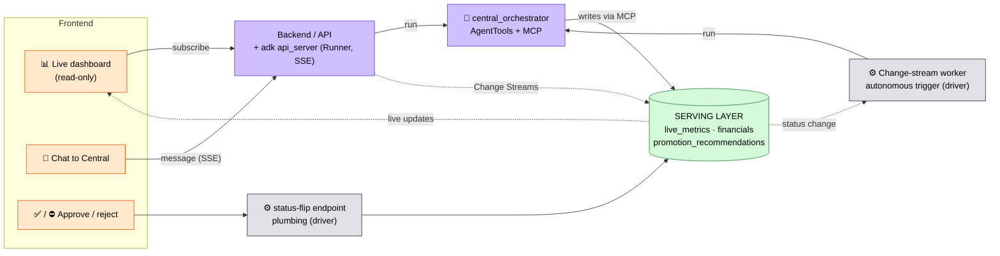

# Restaurant GM — Data Model

## TODO
- [ ] Establish MIT License (hackathon requirement)
- [ ] Order start times should follow a statistical distribution (e.g. lunch/dinner peaks) rather than uniform random

---

Scope: four reasoning agents (**Inventory, Order-mgmt, Billing, Outreach**) plus a
**Central orchestrator**. No seating, staffing, or live-sports agents. All data
is simulated.

---

## Conventions

| Convention | Rule | Example |
|---|---|---|
| **Money** | Integer minor units (cents) in a Money object. Never floats. | `$14.00` → `{ "amount": 1400, "currency": "USD" }` |
| **Timestamps** | RFC 3339 / ISO 8601, UTC (`Z`). | `"2026-06-14T22:31:05Z"` |
| **IDs** | Prefixed strings + Mongo `_id`. | `ord_`, `cust_`, `cat_`, `ing_`, `rec_`, `ven_`, `po_`, `promo_` |
| **Audit** | Every doc: `created_at`, `updated_at`, `source`, `schema_version`. | |
| **Foreign keys** | Plain string IDs referencing another collection's primary ID. | |

## Architecture in one paragraph

A **dimensional (star) core**: `orders` is the fact table at **line-item grain**,
surrounded by dimension collections (menu, recipes, ingredients, customers,
vendors, pricing rules). A **serving layer** (`live_metrics`, `financials`) is
materialized from the facts so the always-on dashboard reads cheap summaries.
The live "orders coming in" behavior is driven by **MongoDB Change Streams**: a
simulated order inserted -> the stream fires -> agents react and the serving
layer updates -> the dashboard refreshes.

**Plumbing vs. reasoning.** Three things are deterministic functions, NOT LLM
steps: (1) order ingestion + **BOM-based stock depletion** (when an order lands,
a function reads the static recipe and decrements `raw_ingredients`), (2)
base metric rollups (revenue, covers), and (3) redemption reconciliation
(`campaign_sends.redeemed` joined back to `orders`). Agents reason over the *results*: Inventory
decides reorders and derives the 86 list, Order-mgmt analyzes the sales stream,
Billing computes margin/feasibility and builds + predicts promo recommendations,
Outreach targets opted-in customers and records sends (redemption reconciliation is
plumbing).

**86 status is derived, never stored on `menu_items`.** An item is unavailable
when the ingredients its recipe needs fall below threshold; the Inventory agent
computes this from `raw_ingredients` + `recipes` and publishes it to `live_metrics`.

---

# Agent architecture

A **manager / sub-agent** setup. The agentic framework is chosen per task, not
one-size-fits-all: **ReAct only where control flow is dynamic; a fixed workflow
elsewhere.** Plumbing (order ingestion, BOM depletion, rollups, the approve/reject
trigger) is plain code with no LLM and is omitted here — see the prose above.

| Framework | Used by | Why |
|---|---|---|
| **ReAct** (reason → act → observe → loop) | Central, Billing | Next action depends on the last observation |
| **Evaluator–Optimizer** (generate → self-check → refine) | Billing | Must validate a promo against guardrails before surfacing |
| **Workflow** (fixed steps / single judgment call) | Inventory, Order-mgmt, Outreach | Deterministic-ish tasks; a loop adds no value |

Each specialist is an ADK `LlmAgent` that reaches MongoDB **through the MongoDB MCP
server** — the agent composes `find` / `aggregate` calls and interprets the results,
but the **arithmetic runs server-side in aggregation pipelines, never in the model**
(invariant #3). The only deterministic, driver-based (non-MCP) code is the
high-frequency, per-order **plumbing**: order ingestion + BOM depletion, base-metric
rollups, and redemption reconciliation. Agent configs live in
[`restaurant_gm/*.yaml`](restaurant_gm/) (`root_agent.yaml` is Central).

The diagram shows each agent, the **tool calls** it makes (expressed as
`find / aggregate / insert / update`), the **data sources** those calls touch
(via the MongoDB MCP server's per-agent `tool_filter`), and the **decision points**
for both the agents and the human. Full per-agent reads/writes are in the
[Per-agent read/write summary](#per-agent-readwrite-summary) at the bottom.


---

# Serving & frontend

The frontend is **one page (a React SPA) with two panels** — an always-on live
dashboard and a chat to Central — plus an approve/reject action. They're not two pages;
they're two connections from the same page that meet only at the approval gate.

- **Dashboard (live, read-only):** does NOT go through the agents or MCP. It reads the
  serving layer (`live_metrics`, `financials`, `promotion_recommendations`) and stays
  live via **Change Streams**. Cheap, and keeps updating even when no agent is running.
- **Chat (request/response):** Central is the ADK root agent, so it is the user-facing
  NL entry point. ADK serves it over an API (`adk api_server` / Cloud Run, with SSE
  streaming + sessions); a chat component posts messages and streams tokens back.
- **Approval gate (where the two meet):** the human clicks approve/reject on a dashboard
  card; that hits a **thin status-flip endpoint** (plumbing, plain driver) which flips
  `promotion_recommendations.status` → a Change Stream fires → Central re-enters its loop.
  Approve/reject never has to go through chat.

Central is invoked from **two sources**, only one of which is the chat API:
1. a **user chat message** (via `adk api_server`), and
2. **autonomous promo evaluation** — a **background worker** that watches Change Streams
   and calls the ADK Runner when an opportunity arises (the same Central agent, run
   programmatically). For a demo this can be faked via chat and added later.



## Concrete stack: FastAPI + React

ADK's serving layer **is FastAPI** — `get_fast_api_app()` returns a real FastAPI app
already exposing session + streaming (`/run_sse`) endpoints backed by a `Runner` (the
ADK engine that runs the agent and streams `Event`s). So there is **one backend**: that
app, with our own routes mounted alongside it.

- **FastAPI backend** (single origin):
  - chat → ADK's `/run_sse` (provided by `get_fast_api_app`),
  - dashboard feed → our SSE/WebSocket route tailing a MongoDB **Change Stream** (`motor`)
    on `live_metrics` / `promotion_recommendations`,
  - approve/reject → our route doing the status flip (`motor` write).
- **React SPA** (one page) talks to that single origin:
  - dashboard panel → `EventSource` on the feed route,
  - chat panel → streaming `fetch` / `EventSource` on `/run_sse`,
  - approve button → `POST` to the status-flip route.
- **Autonomous trigger** → either a Change-Stream worker calling the `Runner` directly,
  or ADK's built-in trigger endpoints (`get_fast_api_app(..., trigger_sources=[...])`,
  e.g. Cloud Scheduler → Pub/Sub → `/trigger`).

The agent YAMLs in [`restaurant_gm/`](restaurant_gm/) are the reasoning core; this
FastAPI backend, the Change-Stream listener + status-flip endpoint, the React SPA, and
the autonomous trigger worker are the serving/IO shell around them (not yet built).

---

# Dimensions (master data — read-only during service)

## `menu_items`
Static catalog. Read by Order-mgmt (item context) and Billing (price/margin).

| Field | Type | Notes |
|---|---|---|
| `item_id` | string | PK, e.g. `cat_item_lager_01` |
| `name` | string | |
| `category` | enum | `starters` \| `mains` \| `drinks` \| `desserts` |
| `price_money` | Money | List price |
| `recipe_id` | FK->recipes | The BOM that backs this item |
| `tags` | string[] | `high_margin`, `shareable`, ... |

```json
{
  "item_id": "cat_item_lager_01",
  "name": "Pint — House Lager",
  "category": "drinks",
  "price_money": { "amount": 600, "currency": "USD" },
  "recipe_id": "rec_lager_01",
  "tags": ["high_margin", "alcohol"],
  "source": "toast", "schema_version": 1,
  "created_at": "2026-01-04T15:00:00Z", "updated_at": "2026-01-04T15:00:00Z"
}
```

## `recipes` (BOM)
Static bill of materials: maps a menu item to its raw ingredients + quantities.
Read by Inventory (map a low ingredient back to affected items) and Billing
(food cost). **Nobody writes this during service.**

| Field | Type | Notes |
|---|---|---|
| `recipe_id` | string | PK, e.g. `rec_lager_01` |
| `menu_item_id` | FK->menu_items | 1:1 with the item |
| `yield_qty` | int | Servings produced |
| `ingredients` | obj[] | `{ ingredient_id (FK->raw_ingredients), qty, unit }` |

```json
{
  "recipe_id": "rec_burger_01",
  "menu_item_id": "cat_item_burger_01",
  "yield_qty": 1,
  "ingredients": [
    { "ingredient_id": "ing_beef_patty", "qty": 1, "unit": "each" },
    { "ingredient_id": "ing_bun",        "qty": 1, "unit": "each" },
    { "ingredient_id": "ing_cheese",     "qty": 1, "unit": "slice" }
  ],
  "source": "manual", "schema_version": 1,
  "created_at": "2026-01-04T15:00:00Z", "updated_at": "2026-01-04T15:00:00Z"
}
```

## `raw_ingredients` (inventory stock)
The one dimension with **dynamic stock**. `on_hand_qty` is mutated by plumbing
(depletion on sale, replenishment on PO receipt). Read by Inventory (monitor)
and Billing (stock feasibility).

| Field | Type | Notes |
|---|---|---|
| `ingredient_id` | string | PK, e.g. `ing_beef_patty` |
| `name` | string | |
| `unit` | enum | `each` \| `kg` \| `liter` \| `slice` ... |
| `on_hand_qty` | number | **Dynamic** |
| `par_level` | number | Target stock |
| `reorder_point` | number | Inventory agent reorders below this |
| `unit_cost_money` | Money | Latest cost per unit |
| `preferred_vendor_id` | FK->vendors | |

```json
{
  "ingredient_id": "ing_beef_patty",
  "name": "Beef patty (4oz)", "unit": "each",
  "on_hand_qty": 180, "par_level": 300, "reorder_point": 120,
  "unit_cost_money": { "amount": 95, "currency": "USD" },
  "preferred_vendor_id": "ven_metro_meats",
  "source": "manual", "schema_version": 1,
  "created_at": "2026-01-04T15:00:00Z", "updated_at": "2026-06-14T22:14:00Z"
}
```

## `customers` (CRM)
Guest profiles with demographics and behavioral signals. Read by Billing
(prediction, targeting) and Outreach (targeting, opt-in).

| Field | Type | Notes |
|---|---|---|
| `customer_id` | string | PK, e.g. `cust_8a3f2c` |
| `name` / `email_masked` | string | PII masked |
| `age` | int | |
| `gender` | enum | `M` \| `F` \| `other` \| `prefer_not_to_say` |
| `city` | string | e.g. `"Chicago"` |
| `state` | string | 2-letter, e.g. `"IL"` |
| `zip_code` | string | |
| `dietary_flags` | string[] | `vegetarian`, `gluten_free`, `vegan`, `halal`, `none` |
| `recency_days` | int | Days since last visit (RFM — R) |
| `lifetime_value_money` | Money | Total spend to date (RFM — M) |
| `avg_check_money` | Money | Average order value |
| `price_sensitivity` | float | 0–1, drives promo uptake prediction |
| `loyalty_tier` | enum | `none` \| `silver` \| `gold` |
| `opt_in_marketing` | bool | Outreach may only target `true` |
| `favorite_item_ids` | FK[]->menu_items | |

## `vendors`
Supplier catalog. Read by Inventory (price + lead time when reordering).

| Field | Type | Notes |
|---|---|---|
| `vendor_id` | string | PK, e.g. `ven_metro_meats` |
| `name` / `contact_masked` | string | |
| `supplies` | obj[] | `{ ingredient_id (FK), unit_cost_money, min_order_qty, lead_time_days }` |
| `rating` | float | 0–5, simulated reliability |

```json
{
  "vendor_id": "ven_metro_meats",
  "name": "Metro Meats Co.", "contact_masked": "orders@•••.com",
  "supplies": [
    { "ingredient_id": "ing_beef_patty", "unit_cost_money": { "amount": 95, "currency": "USD" }, "min_order_qty": 100, "lead_time_days": 1 }
  ],
  "rating": 4.6,
  "source": "manual", "schema_version": 1,
  "created_at": "2025-09-01T12:00:00Z", "updated_at": "2026-06-10T09:00:00Z"
}
```

## `pricing_rules` (config + location)
Singleton config holding Billing's guardrails and location-level facts.

| Field | Type | Notes |
|---|---|---|
| `rule_id` | string | PK, e.g. `cfg_default` |
| `min_margin_pct` | number | Billing won't recommend below this |
| `max_discount_pct` | number | Cap on any single promo |
| `blackout_item_ids` | FK[]->menu_items | Never discountable |
| `tax_rate_bps` | int | Sales tax (875 = 8.75%) |
| `currency` | string | `USD` |

---

# Facts / events

## `orders` (the fact table)
Header + embedded `line_items` (the grain). Written by the **order pipeline /
simulator** (plumbing). Read by Inventory (velocity), Order-mgmt (sales
analysis), Billing (sales/COGS).

| Field | Type | Notes |
|---|---|---|
| `order_id` | string | PK |
| `state` | enum | `OPEN` \| `COMPLETED` \| `CANCELED` |
| `channel` | enum | `DINE_IN` \| `TAKEOUT` |
| `customer_id` | FK->customers | Nullable |
| `guest_count` | int | |
| `opened_at` / `closed_at` | timestamp | |
| `line_items` | obj[] | `{ uid, item_id (FK->menu_items), name, quantity, unit_price_money, gross_money, applied_discount_money, promo_id (FK->promotions, nullable) }` |
| `total_money` / `total_tax_money` / `total_discount_money` / `net_amount_money` | Money | Precomputed |

```json
{
  "order_id": "ord_20260614_0042",
  "state": "COMPLETED", "channel": "DINE_IN",
  "customer_id": "cust_8a3f2c", "guest_count": 4,
  "opened_at": "2026-06-14T21:59:00Z", "closed_at": "2026-06-14T22:48:00Z",
  "line_items": [
    { "uid": "li_1", "item_id": "cat_item_lager_01", "name": "Pint — House Lager",
      "quantity": 6, "unit_price_money": { "amount": 600, "currency": "USD" },
      "gross_money": { "amount": 3600, "currency": "USD" },
      "applied_discount_money": { "amount": 720, "currency": "USD" },
      "promo_id": "promo_celebration_77" }
  ],
  "total_tax_money": { "amount": 252, "currency": "USD" },
  "total_discount_money": { "amount": 720, "currency": "USD" },
  "net_amount_money": { "amount": 2880, "currency": "USD" },
  "total_money": { "amount": 3132, "currency": "USD" },
  "source": "toast", "schema_version": 1,
  "created_at": "2026-06-14T21:59:00Z", "updated_at": "2026-06-14T22:48:00Z"
}
```

## `purchase_orders`
The Inventory agent's reorders to vendors. Written by Inventory.

| Field | Type | Notes |
|---|---|---|
| `po_id` | string | PK |
| `vendor_id` | FK->vendors | |
| `status` | enum | `draft` \| `placed` \| `received` \| `canceled` |
| `line_items` | obj[] | `{ ingredient_id (FK), qty, unit_cost_money, line_total_money }` |
| `total_money` | Money | |
| `placed_at` / `expected_delivery` / `received_at` | timestamp | |
| `created_by` | string | `agent:inventory` |

## `campaign_sends`
Every outreach push, and whether it was redeemed. **Inserted by Outreach** (the push);
`redeemed` / `redeemed_order_id` are **reconciled by plumbing** (high-frequency,
event-driven — invariant #3). This is how *actual* uptake is measured (join
`redeemed_order_id` back to `orders`).

| Field | Type | Notes |
|---|---|---|
| `send_id` | string | PK |
| `promo_id` | FK->promotions | |
| `customer_id` | FK->customers | |
| `channel` | enum | `sms` \| `push` \| `email` |
| `status` | enum | `queued` \| `sent` \| `delivered` \| `failed` |
| `redeemed` | bool | |
| `redeemed_order_id` | FK->orders | Nullable |
| `sent_at` | timestamp | |

## `agent_events` (the transparency log)
Append-only. **Every agent writes here.** This is the audit trail behind every
recommendation's "why."

| Field | Type | Notes |
|---|---|---|
| `event_id` | string | PK |
| `agent` | enum | `central` \| `inventory` \| `order_mgmt` \| `billing` \| `outreach` |
| `action` | string | e.g. `recommend_promo`, `place_po`, `flag_86` |
| `summary` | string | One-line human-readable |
| `reasoning` | string | Short rationale |
| `related_ids` | obj | `{ recommendation_id?, order_id?, promo_id?, po_id? }` |
| `created_at` | timestamp | |

---

# Decision artifacts

## `promotion_recommendations` (the heart of the product)
What Billing produces and the human approves. Carries the full justification so
the dashboard card can be transparent. Written by Billing; status flipped by
Central on the human's yes/no.

| Field | Type | Notes |
|---|---|---|
| `recommendation_id` | string | PK, e.g. `rec_77` |
| `status` | enum | `pending` \| `approved` \| `rejected` \| `expired` |
| `proposal` | obj | `{ title, description, discount_type, discount_value, applies_to_item_ids[], target_criteria{} }` |
| `justification.analytical` | obj[] | `{ metric, value, source_table, note }` — the real-data evidence |
| `justification.predictive` | obj | `{ predicted_uptake, predicted_incremental_revenue_money, predicted_margin_after_pct, confidence, model_note }` |
| `decided_by` / `decided_at` | string/ts | The human + when |
| `resulting_promo_id` | FK->promotions | Set on approval |
| `created_by` | string | `agent:billing` |

```json
{
  "recommendation_id": "rec_77",
  "status": "pending",
  "proposal": {
    "title": "House Lager — 20% for 30 min",
    "description": "Push the highest-margin drink while the room is full.",
    "discount_type": "PERCENTAGE", "discount_value": 20,
    "applies_to_item_ids": ["cat_item_lager_01"],
    "target_criteria": { "loyalty_tier": ["silver", "gold"], "max_price_sensitivity": 0.6, "city": "Chicago" }
  },
  "justification": {
    "analytical": [
      { "metric": "lager gross margin", "value": "77%", "source_table": "menu_items+recipes", "note": "even at 20% off, margin stays 71%" },
      { "metric": "current stock cover", "value": "~3.5 hrs", "source_table": "raw_ingredients", "note": "240 pints on hand" },
      { "metric": "opted-in target size", "value": "138 customers", "source_table": "customers", "note": "silver/gold loyalty, price_sensitivity < 0.6, Chicago, opt_in only" }
    ],
    "predictive": {
      "predicted_uptake": 0.34,
      "predicted_incremental_revenue_money": { "amount": 21500, "currency": "USD" },
      "predicted_margin_after_pct": 71,
      "confidence": 0.62,
      "model_note": "uptake scaled by price_sensitivity and loyalty_tier"
    }
  },
  "decided_by": null, "decided_at": null, "resulting_promo_id": null,
  "created_by": "agent:billing", "source": "matchday_gm", "schema_version": 1,
  "created_at": "2026-06-14T22:30:51Z", "updated_at": "2026-06-14T22:30:51Z"
}
```

## `promotions` (approved / live)
Created when a recommendation is approved. Written/configured by Billing; read
by Outreach to push. `redemption_count` reconciled from `campaign_sends`/`orders` by plumbing.

| Field | Type | Notes |
|---|---|---|
| `promo_id` | string | PK |
| `recommendation_id` | FK->promotion_recommendations | |
| `title` / `description` | string | |
| `discount_type` / `discount_value` | enum/int | |
| `applies_to_item_ids` | FK[]->menu_items | |
| `target_criteria` | obj | Agent-determined targeting (loyalty_tier, city, age range, dietary_flags, etc.) |
| `status` | enum | `live` \| `scheduled` \| `expired` |
| `valid_from` / `valid_until` | timestamp | |
| `predicted_uptake` | float | Carried from the recommendation |
| `redemption_count` | int | Actual, reconciled by plumbing |
| `approved_by` | string | |

---

# Serving / derived

## `live_metrics` (dashboard state)
A small current-state document the dashboard reads. Base fields (revenue,
covers) updated by plumbing; insight fields written by the agents.

| Field | Type | Written by |
|---|---|---|
| `as_of` | timestamp | plumbing |
| `shift_revenue_money` | Money | plumbing |
| `covers` | int | plumbing |
| `gross_margin_pct` | number | Billing |
| `sales_pace_vs_baseline_pct` | number | Order-mgmt |
| `top_movers` | obj[] | Order-mgmt — `{ item_id, qty, velocity }` |
| `low_stock` | obj[] | Inventory — `{ ingredient_id, status }` |
| `eighty_sixed_item_ids` | FK[]->menu_items | Inventory (derived) |
| `active_promo_perf` | obj[] | Billing — `{ promo_id, predicted_uptake, actual_redemptions }` |

## `financials` (periodic rollups)
Derived shift/day P&L. Written by Billing.

| Field | Type | Notes |
|---|---|---|
| `period_id` | string | PK, e.g. `2026-06-14:dinner` |
| `period_start` / `period_end` | timestamp | |
| `gross_revenue_money` | Money | |
| `cogs_money` | Money | From orders x recipes |
| `discount_money` | Money | |
| `net_revenue_money` | Money | |
| `gross_margin_pct` | number | |
| `by_category` | obj[] | `{ category, revenue_money, margin_pct }` |

---

# Foreign-key map

```
menu_items.recipe_id ─────────────► recipes.recipe_id
recipes.ingredients[].ingredient_id ► raw_ingredients.ingredient_id
raw_ingredients.preferred_vendor_id ► vendors.vendor_id
vendors.supplies[].ingredient_id ───► raw_ingredients.ingredient_id

orders.line_items[].item_id ───────► menu_items.item_id
orders.line_items[].promo_id ──────► promotions.promo_id
orders.customer_id ────────────────► customers.customer_id

purchase_orders.vendor_id ─────────► vendors.vendor_id
purchase_orders.line_items[].ingredient_id ► raw_ingredients.ingredient_id

campaign_sends.promo_id ───────────► promotions.promo_id
campaign_sends.customer_id ────────► customers.customer_id
campaign_sends.redeemed_order_id ──► orders.order_id

promotion_recommendations.resulting_promo_id ► promotions.promo_id
promotions.recommendation_id ──────► promotion_recommendations.recommendation_id
```

# Per-agent read/write summary

| Agent | Reads | Writes |
|---|---|---|
| **Inventory** | raw_ingredients, recipes, vendors, orders (velocity) | purchase_orders, live_metrics (low_stock + 86), agent_events |
| **Order-mgmt** | orders, menu_items | live_metrics (sales pace, top movers), agent_events |
| **Billing** | orders, menu_items, recipes, raw_ingredients, pricing_rules, customers (demographics + behavioral signals) | promotion_recommendations, promotions, live_metrics (margins), financials, agent_events |
| **Outreach** | customers, promotion_recommendations, promotions | campaign_sends (sends/pushes), agent_events |
| **Central** | agent_events | promotion_recommendations (status on approval), agent_events |
| **Pipeline (plumbing)** | recipes (for depletion), campaign_sends + orders (for reconciliation) | orders, raw_ingredients (deplete/replenish), live_metrics (base), campaign_sends (redemption reconciliation) |
